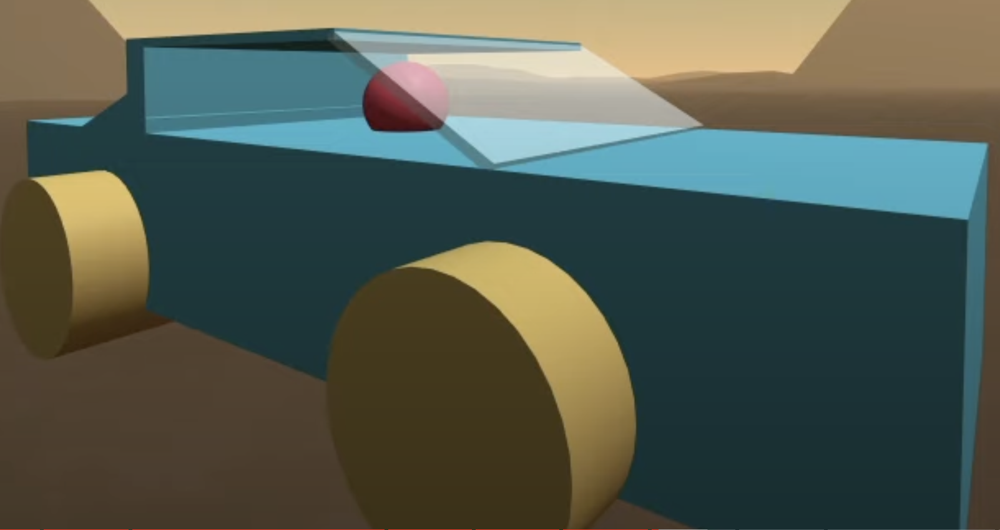
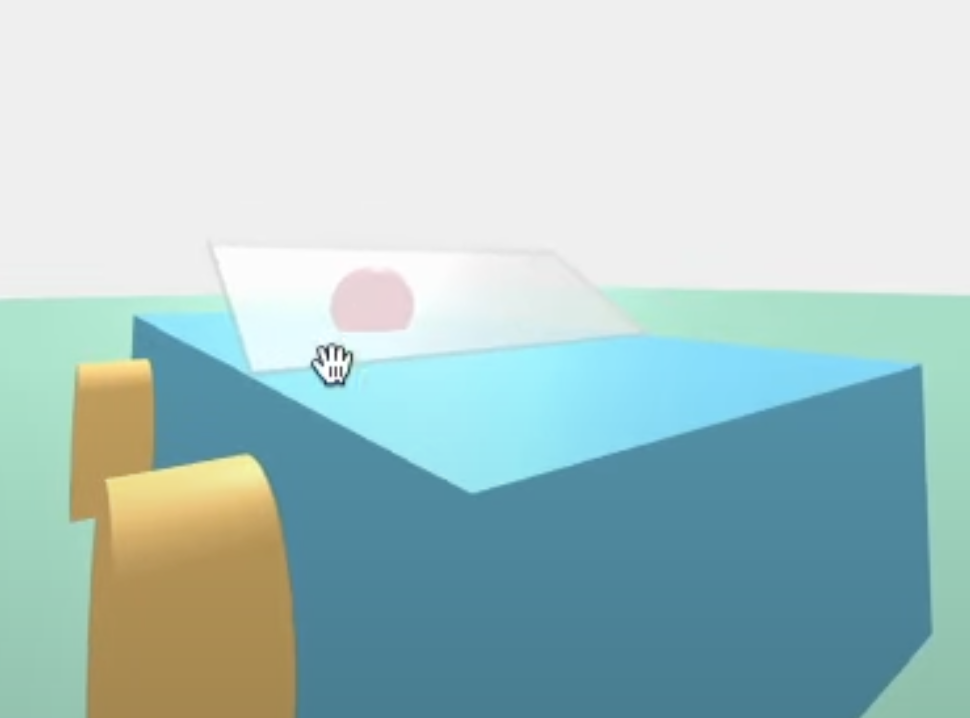
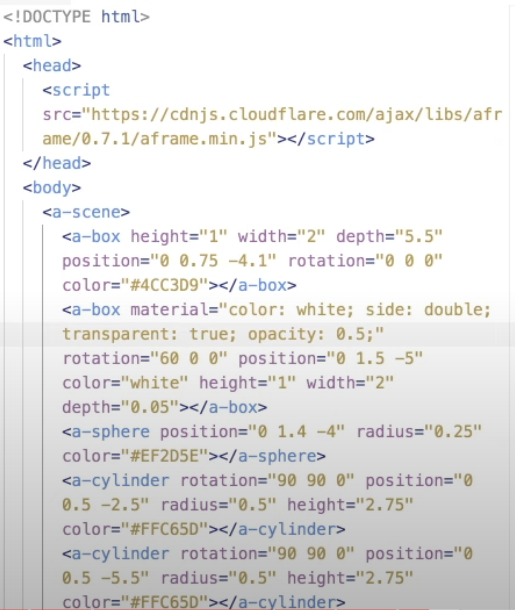

# Entry 2
#### 11/17/2023

Engineering Design Process:

My current stage in the Engineering Design Process (EDP) is still to better understand my tool and how to utilize it. To better understand my tool I have been reading other people's projects, they were made with an A-frame and their process. I have also been following tutorials  and exploring other projects for ideas. My next step is leaning the components are shadow, pool, layers and light. My next steps are making a demo 

As I have mentioned I cloned the A-Blast project into my IDE after I have done the tinkering with A-Blast I have moved on to other methods. [Tutorial ](https://www.youtube.com/watch?v=y5SZCYT0Zwo)

In the blogs people talk about their projects and in some they show the project, in others they talk about their process and struggles. My personal favorite story is because I want to make something similar to it
[One of the Blogs ](https://markpescecodex.com/we5/na.html)
[Blogs ](https://aframe.io/blog/newsletter2/)

The project that I have taken inspiration from is
[Projects](https://www.kodub.com/apps/planetsbyearth)
This project was really interesting to watch but the animation was very slow. In my project I will be focusing on not making animation slow and having a setting related to a starry-night.

I have learned how to:
* make the block color clear ( I have to use transparency and opacity)
* how to make the shape bend
* how to make the shape rotate
* I learned that the numbers need " " around them.
* Aframe already has many shapes that are saved in the site.
* code changes- is very helpful to get/code new shapes && new colors
* I can also add new environments using code changes.

Through the video I have gotten many insights on how to code on a frame. The more I learned through the video the more excited I felt to learn about it. The video helped me understand how I am going to make an aircraft and make the setting a night setting but I want to be able to change the setting from night to day, that's my future goal.

#### Results

#### mid-step

#### Code

## Content/Goal:

My partner and I are using a-frame  because we want to make a video game that is pleasing to the eye, while being entertaining. Our goal is to make a game that is interesting and relaxing. It may sound ironic that a shooting game can be relaxing but all of the frustration and anger or stress can be let out through playing games. According to the article Do Video Games Reduce Stress? We are going to use games that have already been made through A Frame to take inspiration and eventually make a game that has 360 images where you can move and interact with objects like cars, airplanes and guns. I have decided to create a flying obstacle game using A-Frame. To experiment with my tool, I undertook various tasks.

## skill
Organization: I had to organize my code so it was clear. Organizing the code was really important because I was learning something new. Organization was important for me to undertsand what each code did and if I had a bug. The main thing I focused on was indexation to organize my code better. 

Research/Growth mindset: I had to incorporate a growth mindset because I would have to research a lot and for that I would need patience to able able to research. Following through the tutorial was also a hassle because there were many new things I learned at the same time.

[Previous](entry01.md) | [Next](entry03.md)

[Home](../README.md)

